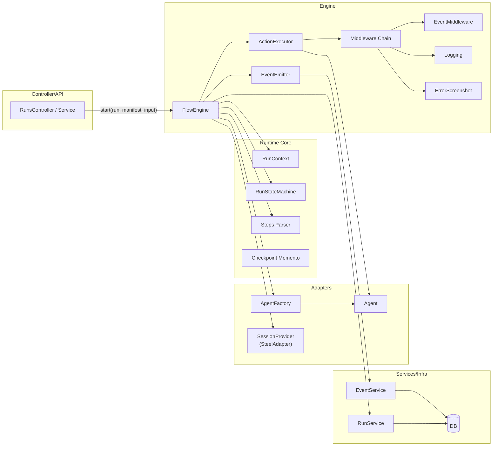
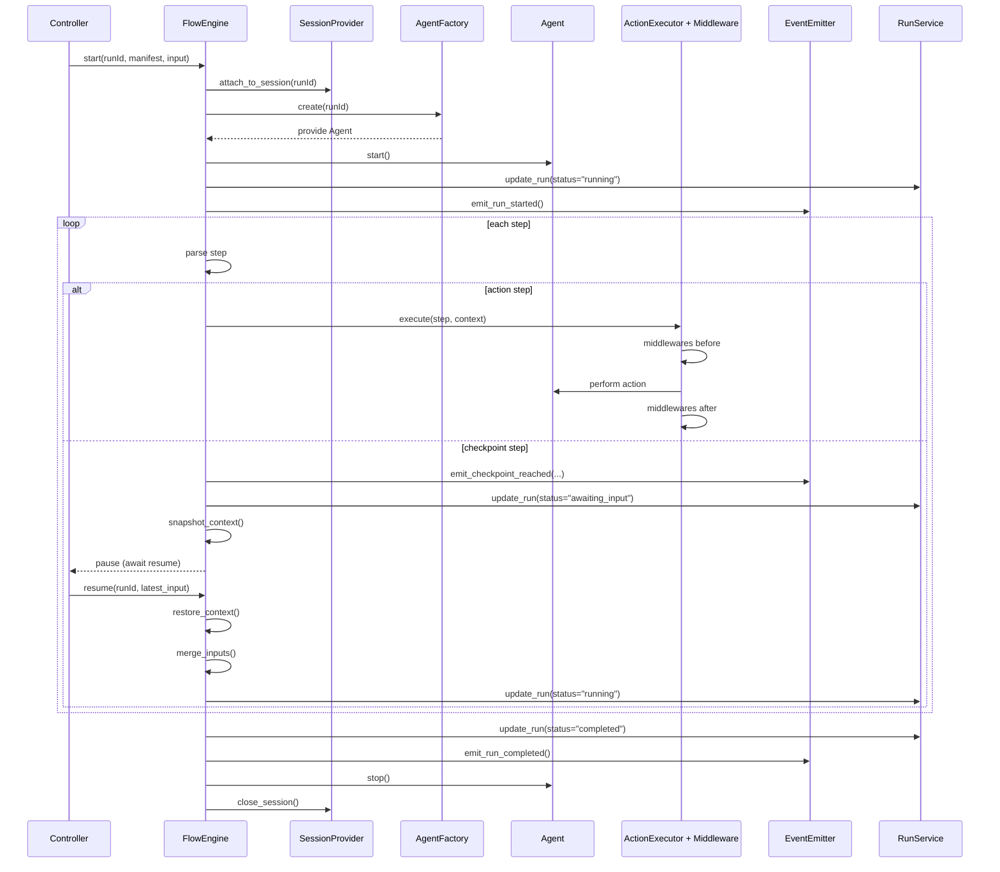

# Runtime Architecture

This document describes the intended, declarative architecture for the runtime layer.
It is designed around four key concepts:

- Command/Registry for actions
- Executor with middleware for cross-cutting concerns
- Coordinator for pause/resume orchestration
- Flow Engine as the single orchestration entry point

## Components

## Sequence: Start → Checkpoint → Resume → Complete

## Developer Experience (DX)

- **Add an action**: implement `Action.execute(context, agent, events)` and `registry.register("my_action", factory)` in `app/runtime/actions/`.
- **Start a flow**: Controller calls `FlowEngine.start(run, manifest, input)`.
- **Resume a flow**: Controller calls `FlowEngine.resume(run_id, latest_input)`; engine restores memento and continues.
- **Cross-cutting concerns**: add a middleware to `engine/middleware.py`.
